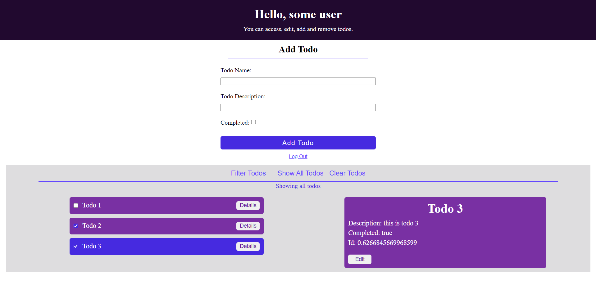

# this is my react app.

## use instructions
app comes with two default users, user-one with password: user123 and user-two with password: user123
user-one already has some todos to explore. you can create as many users as you like and add, remove and edit their todos. 

## project explained
project is built using react. I combined context and reducer, which you can find in UsersContext.js file. App.js is 'brain' of the app, it decides which component to render. You can find different components that i made inside src/components directory.